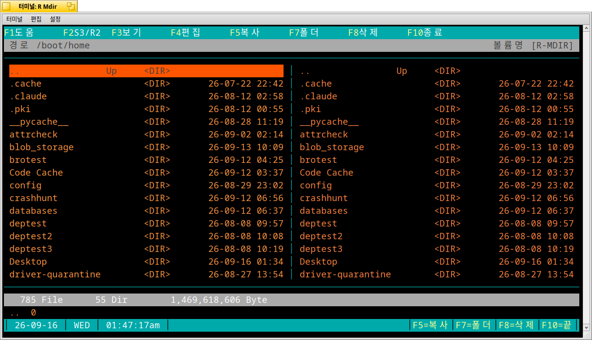

# R Mdir

고전 **Mdir III**의 화면, 확장자별 색상, 기능키 중심 조작을 터미널에 옮긴 2분할 파일 관리자입니다. 로컬 파일 시스템과 S3, Cloudflare R2를 같은 패널에서 탐색합니다.



macOS, Linux, Haiku 터미널에서 동작합니다. 위 캡처는 Haiku R1~beta6(x86, 32비트) Terminal 화면입니다.

## 설치 및 실행

```sh
cargo build --release
./target/release/m
```

또는 `cargo install --path .` 후 어느 경로에서나 `m`을 실행합니다. 한글과 색상이 잘 보이도록 UTF-8 및 256색/true-color 터미널을 권장합니다.

## S3 / R2 연결

원격 저장소는 설정 파일의 `[remote.<이름>]` 항목 하나가 프로필 하나입니다. 설정 파일이 없거나 프로필이 하나도 없으면 `F2`를 눌렀을 때 설정 파일 경로와 예시를 보여 주는 안내 창이 뜹니다.

### 1. 설정 파일 위치

| OS | 경로 |
|---|---|
| macOS | `~/Library/Application Support/mdir/config.toml` |
| Linux | `~/.config/mdir/config.toml` |
| Haiku | `/boot/home/.config/mdir/config.toml` |

환경 변수 `MDIR_CONFIG`에 파일 경로를 넣으면 그 파일을 대신 읽습니다. 정확한 경로는 `F2` 안내 창에도 표시됩니다.

```sh
MDIR_CONFIG=./my-config.toml m
```

### 2. Cloudflare R2

1. Cloudflare 대시보드 → R2 → **Manage R2 API Tokens** → **Create API Token**.
2. 권한은 **Object Read only**면 충분합니다 (R Mdir은 원격에 쓰지 않습니다). 필요하면 버킷을 한정합니다.
3. 발급 화면의 Access Key ID, Secret Access Key, 그리고 엔드포인트 `https://<ACCOUNT_ID>.r2.cloudflarestorage.com`을 아래에 넣습니다.

```toml
[remote.r2]
kind = "r2"
region = "auto"
endpoint = "https://<ACCOUNT_ID>.r2.cloudflarestorage.com"
access_key_id = "<R2 Access Key ID>"
secret_access_key = "<R2 Secret Access Key>"
# bucket = "assets"   # 지정하면 이 버킷만 보입니다. 토큰이 버킷 한정이면 반드시 지정하세요.
```

### 3. AWS S3

```toml
[remote.aws]
kind = "s3"
region = "ap-northeast-2"
# access_key_id / secret_access_key를 생략하면 ~/.aws/credentials, 환경 변수, IAM 역할 순으로 찾습니다.
# bucket = "my-bucket"
```

MinIO처럼 S3 호환 서버는 `kind = "s3"`에 `endpoint`와 `path_style = true`를 추가합니다.

### 4. 사용

`F2`를 누르면 오른쪽 패널에 프로필 목록이 열립니다. Enter로 버킷과 폴더를 내려가고, `Backspace`나 `←`로 올라갑니다. 객체를 받으려면 왼쪽 패널을 로컬 폴더로 두고 객체 위에서 `F5`를 누릅니다. 원격 저장소는 읽기 전용이라 `F5`(업로드), `F7`, `F8`은 거부됩니다. 접속 오류는 하단 상태줄에 노란색으로 표시됩니다.

설정 파일에는 비밀 키가 들어가므로 `chmod 600`을 권장합니다. `mdir.example.toml`에 전체 예시가 있습니다.

## 주요 키

| 키 | 기능 |
|---|---|
| `↑/↓`, `Home/End` | 선택 이동 |
| 영문/숫자 | 이름 앞글자로 빠른 이동 |
| `Enter`, `→` | 폴더 열기. 로컬 파일이 실행 권한이 있으면 그 자리에서 실행 |
| `Backspace`, `←` | 상위 위치 (검색 중이면 검색어 지우기) |
| `Tab` | 패널 전환 |
| `F1`, `?` | 도움말 |
| `F2` | S3/R2 프로필 |
| `F5` | 반대편 로컬 패널로 복사/다운로드 |
| `F7` | 새 폴더 |
| `F8` | 삭제 (Y/N 확인) |
| `Ctrl+R` | 새로 고침 |
| `F10`, `Esc`, `q` | 종료 |

주의: `F8`은 파일과 비어 있는 폴더만 지웁니다. 비어 있지 않은 폴더는 거부되며, 삭제는 휴지통을 거치지 않습니다.

실행 권한이 있는 로컬 파일에서 `Enter`를 누르면 화면을 잠시 벗어나 그 파일을 실제 터미널에서 실행합니다. 종료 코드를 보여 주는 "아무 키나 누르면 R Mdir로 돌아갑니다" 안내가 뜨고, 키를 하나 누르면 같은 위치의 R Mdir 화면으로 돌아옵니다. 원격 저장소의 항목이나 실행 권한이 없는 파일은 예전처럼 이름·크기·수정 시각만 보여 줍니다.

## 라이선스

MIT License. `LICENSE` 파일을 참고하세요. 원조 **Mdir III**의 저작권과 이름은 그 저자에게 있으며, R Mdir는 소스 코드를 공유하지 않는 독자적인 재구현입니다.

## AI 사용 고지

이 프로그램은 Claude와 함께 작성했습니다.
